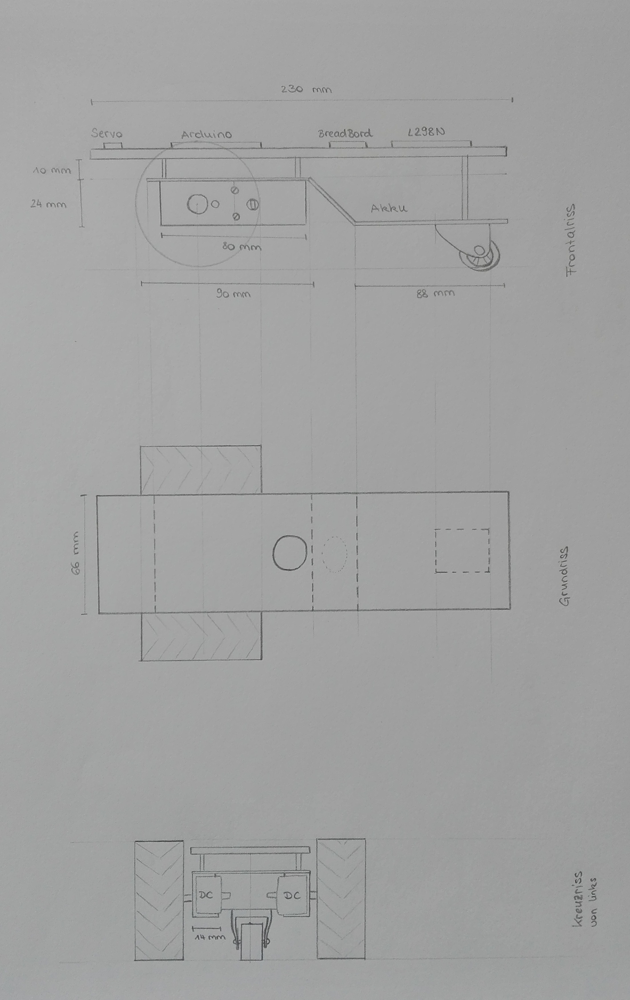
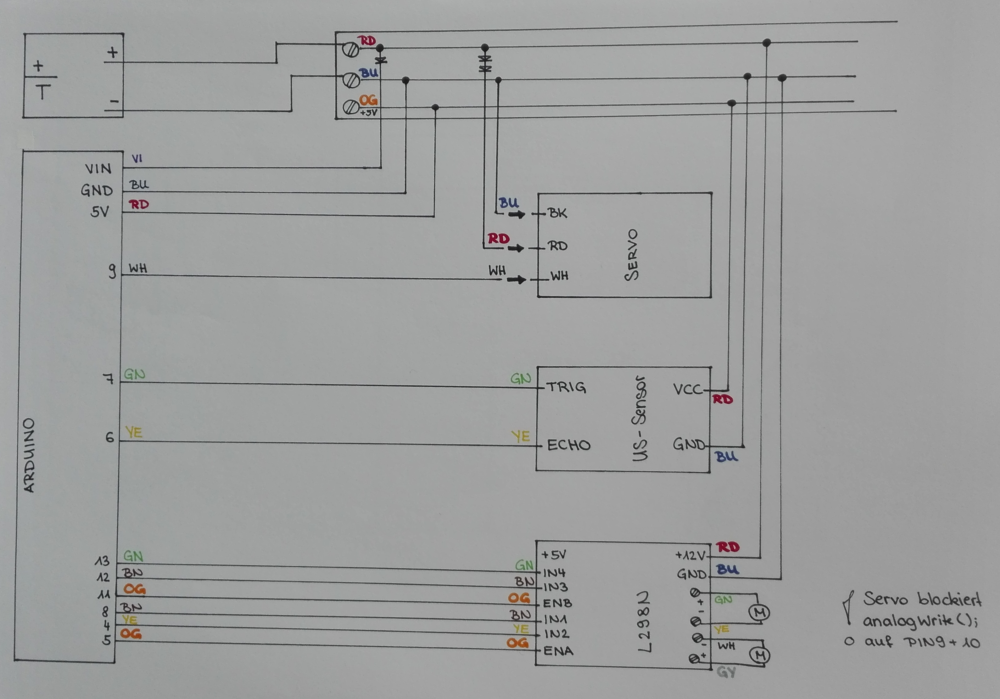

# Planung

Die Planung erfolgte aufgrund der verfügbaren Bauteile:

- Arduino Uno
- Ultraschallsensor
- Servo
- 2 Farbsensoren
- 2 Abstandssensoren
- 2 DC-Motoren inklusive Rad
- Motorschutz
- Taster

## Skizze des Autos

Die folgende Skizze beinhaltet eine maßstäbliche Grobplanung des Aufbaus des selbstfahrenden Autos. Momentan wird dabei nur die Planung eines Autos mit Servo und Ultraschallsensor behandelt und kein Line-Follower.

```{r skizze, echo=FALSE}

```


## Schaltplan

Der momentane ersichtliche Schaltplan beinhaltet die Verkabelung für ein selbstfahrendes Auto mit Ultraschallsensor und Servo. Weiters wird hier ein Akku als Stromquelle angenommen.  

**Wichtig:** Wenn ein Servo verwendet wird, verhindert dieser ein `analogWrite();` auf Pin 9 und Pin 10. Jedoch kann das Servo sehr wohl an diesen Pins angeschlossen werden.

```{r schaltplan, echo=FALSE}

```

