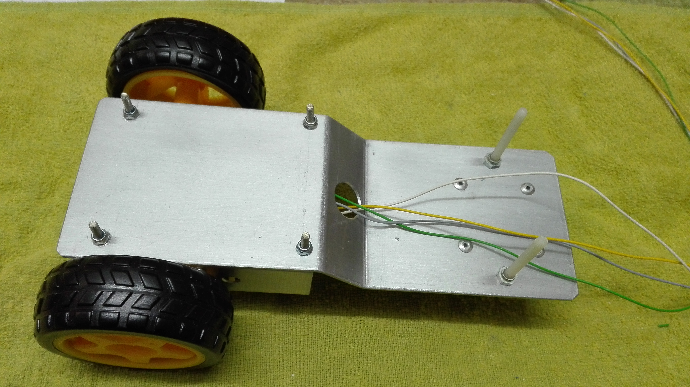
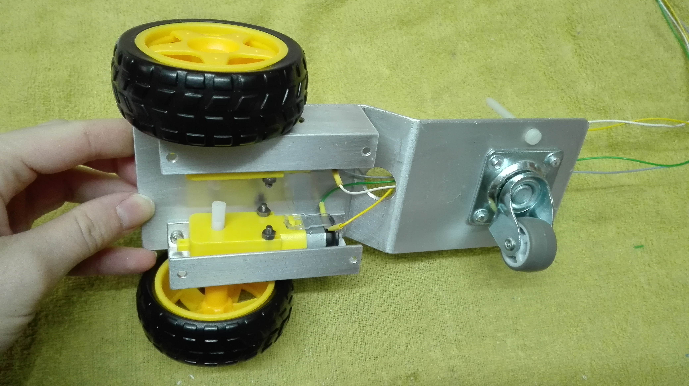
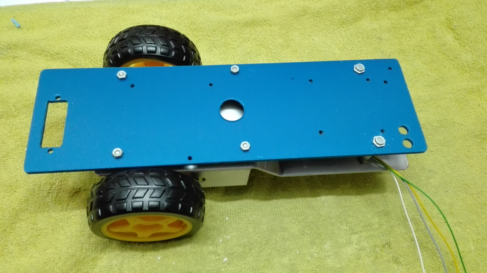
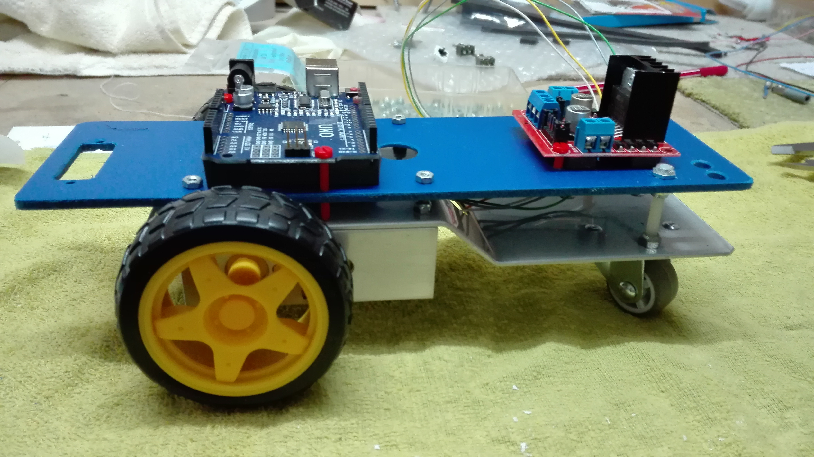
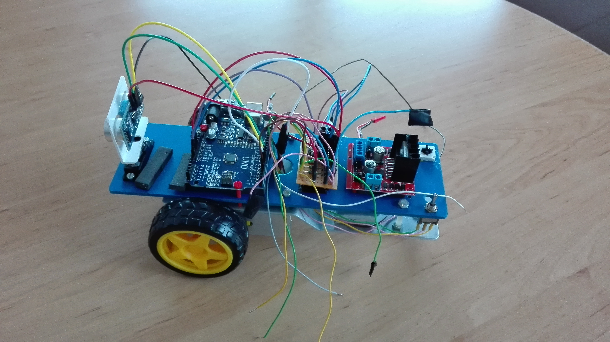
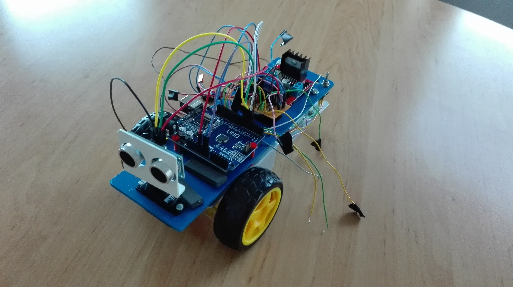

# Bauen des Autos

Die Bodenplatte besteht aus Aluminium und wurde "gekantet" (sprich gebogen). Zusätzlich wurde die Platte noch mit Klarlack lackiert, sodass das schwarze Abfärben des Aluminiums verhindert wird.  
Die Aufhängung der DC-Motoren besteht aus einem zugeschnittenen Aluminiumprofil.

```{r unterboden, echo=FALSE, out.width="50%", fig.align='center'}

```

Im oberen Bild sieht man den Unterboden (inlusiver montierter DC-Motoren) von oben. Im folgenden Bild ist die Konstruktion von unten zu sehen.

```{r unterboden2, echo=FALSE, out.width="50%", fig.align='center'}

```

Mithilfe von Schrauben und Muttern wurde die blaue Bodenplatte auf die gewünschte Höhe gebracht und fixiert. Dies ist auf dem folgenden Bild ersichtlich.

```{r boden, echo=FALSE, out.width="50%", fig.align='center'}

```

Der Arduino Uno und der Motortreiber wurden mithilfe von Plastikschrauben auf der blauen Bodenplatte fixiert. Dafür wurden die bereits vorgebohrten Löcher verwendet, welche nicht im Plan aufscheinen.

```{r bodenArduino, echo=FALSE, out.width="50%", fig.align='center'}

```

Da selbstgebastelte und gelötete Bread-Bord wurde mithilfe eines Klettstreifens auf der blauen Bodenplatte befestigt. Für das Servo wurde ein passendes Loch in die Platte geschnitten. Weiters wurde aus einer Plastikschiene noch eine Halterung für den Ultraschallsensor gebastelt.
Danach erfolgte die Verkabelung laut dem Schaltplan.

```{r verkabelung, echo=FALSE, out.width="50%"}


```

